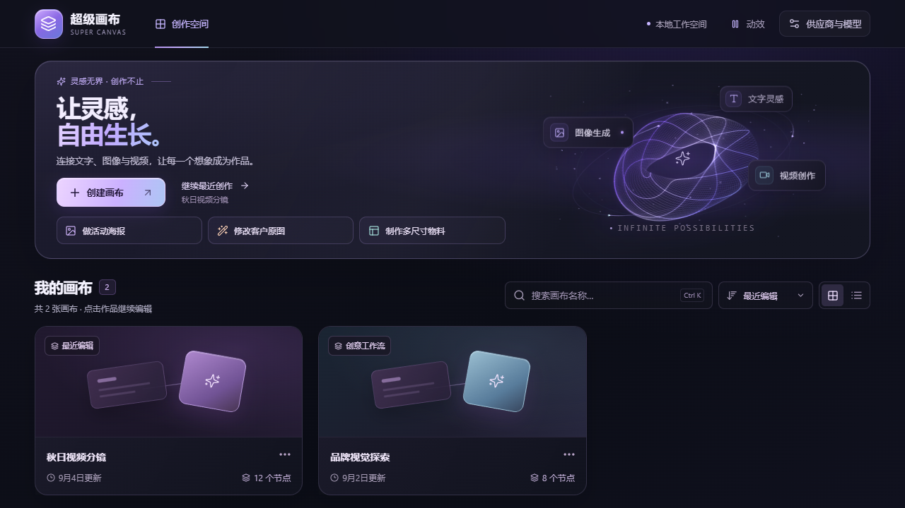
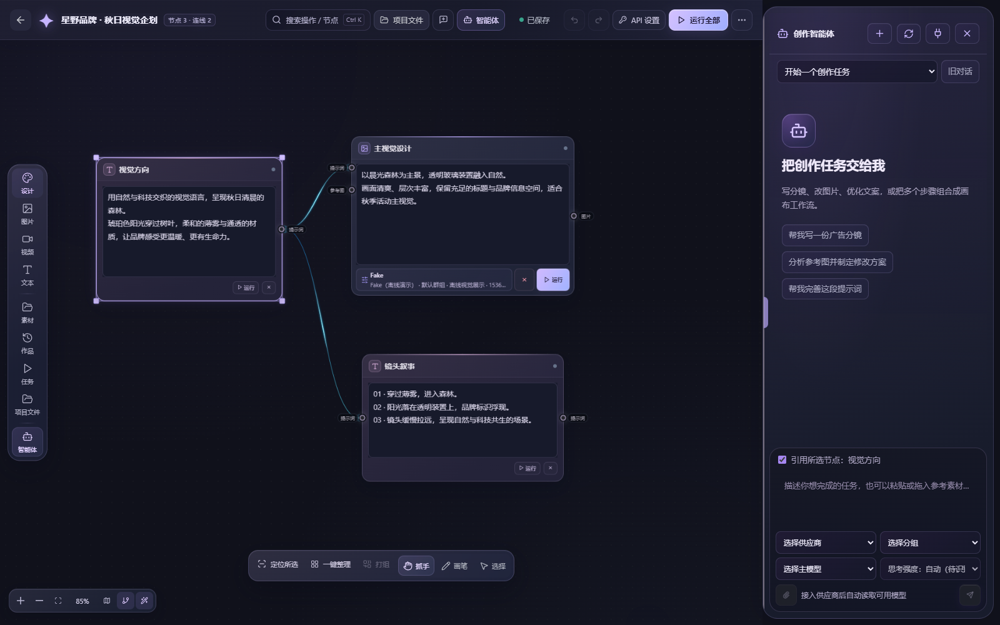
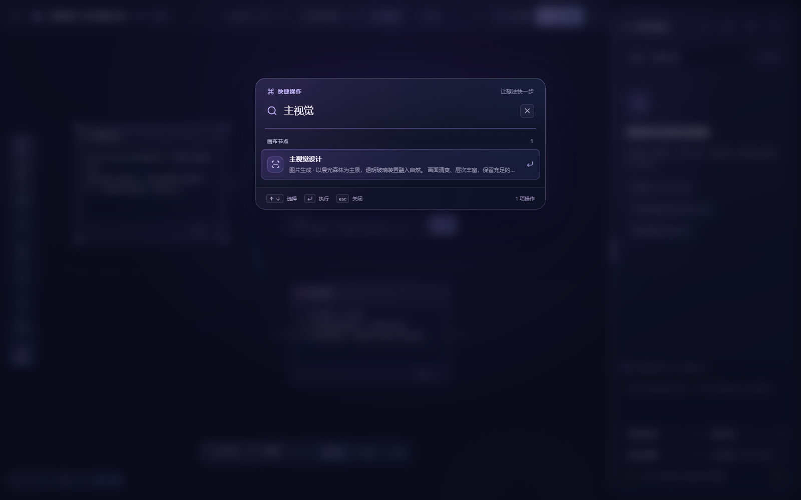

# 创作工作台 UI 改版 · 2026-10-07

本轮按照用户要求回到原有紫蓝、玻璃与柔光的视觉方向，细化首页构图、卡片和画布层次。保留任务入口、常显工具标签与节点搜索，使外观调整同时改善日常操作。最终版本替换了本轮早期的石墨与薄荷绿方案。

## 首页

- 恢复「让灵感，自由生长。」双行标题及原有动态 Aura，以紫蓝渐变字、光泽主按钮和右侧光球形成首页焦点。
- 压缩 Hero 高度，活动海报、原图修改、多尺寸物料三条任务入口与真实最近项目保持容易触达。
- 项目区提供实际数量、搜索结果数、排序、网格/列表；Ctrl+K 可聚焦项目搜索。
- 项目封面完整显示图片；窄窗口按空间调整列数，列表模式便于阅读较长名称。
- 无封面的项目使用倾斜玻璃流程卡面，实际封面继续完整显示图片。
- Aura 使用已有 Canvas 2D 实现，动效开关、系统减少动态效果设置及弹窗暂停继续生效。

## 画布

- 左侧工具常显中文：设计、图片、视频、文本、素材、作品、任务、项目文件、智能体。
- 顶部加入快捷搜索，Ctrl+K 可打开，支持中文关键词、节点名称和提示词内容。
- 搜索既能进入创作工具、作品、任务与设置，也能单选并定位到实际节点；支持方向键选择、Enter 执行和 Escape 关闭。
- 选中节点后可从底部「定位所选」返回它，原有全画布适应、整理和绘图工具继续使用。
- 顶栏展示节点和连线数量，桌面宽度允许时显示智能体开关文字。
- 顶栏、工具轨、底部工具及智能体采用深紫蓝玻璃表面、细亮边和柔光；节点表面、标题与正文按明暗形成层次。
- 主按钮使用薰衣草到冰蓝渐变，选中描边、缩放柄与连接提示统一为柔和紫色；红色错误与绿色成功状态保留。
- 提高节点标题、提示词和模型摘要的可读性；智能体欢迎图标、输入区和参数面板采用分层深色表面。

节点查找只改变选择和视图，不过滤或隐藏图结构。搜索打开及节点定位之前同步编辑器缓冲的内容。创建节点不会自动提交生成。

## 兼容与验证

模型参数面板继续在画布坐标中贴靠节点并同比缩放，保留原有 560px 高度和 10px 间距。底部工具继续依据实际画布宽度避让，面板尺寸、自动保存、撤销与生成协议沿用现有实现。

浏览器验收使用隔离数据库与素材目录。新搜索测试拦截生成提交，检查远处节点定位、键盘操作、编辑与原有图数据保留，以及 390–1600px 窗口的显示。

验收结果：

- 共享包编译及 renderer 生产构建成功（构建含 TypeScript 检查）。
- 相关改动文件 ESLint 与 `git diff --check` 通过。
- 首页、画布工作台、智能体与连线、模型面板交互、布局回归共 36 项浏览器测试通过。
- 最后统一节点输入区与实际创作智能体的紫蓝样式，生产构建再次通过；画布工作台与连线的 11 项测试再次通过。
- 节点输入区补齐最终 CSS 优先级后，生产构建与单项完整画布展示验证通过；最终截图确认深靛输入表面及智能体玻璃图标实际生效。
- 测试中发现并修复创建/重命名弹窗初始焦点落在关闭按钮的问题；现在直接聚焦名称输入。
- 新工作台测试没有生成提交；未调用付费模型，未修改真实项目资料。

UI 实现阶段完成源码与 renderer 构建；后续供应商升级工作已将这套界面纳入 v0.2.62 桌面安装包。本地验收使用隔离资料，没有替换用户已安装的桌面程序。

实际运行截图（隔离验收项目）：

